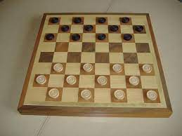
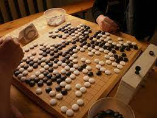
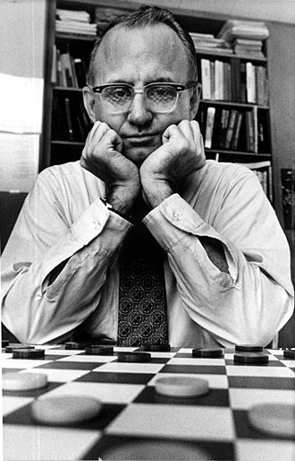
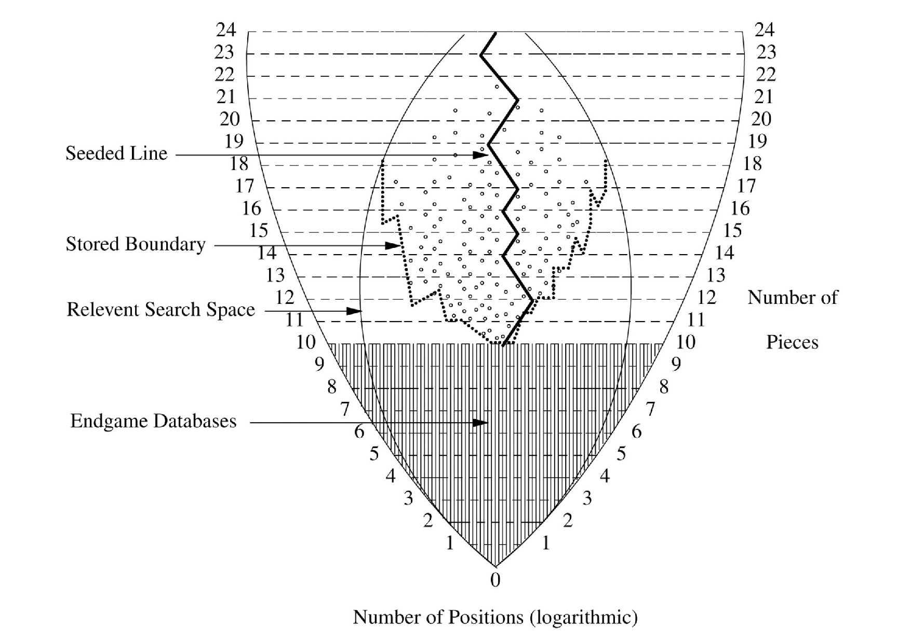

### Introduction

Le terme "jeu combinatoire à information parfaite" définit une catégorie de jeux respectant 4 critères:

- 2 joueurs (ou 2 équipes) s'opposent;
- Ils jouent à tour de rôle;
- Toutes les données sont connues par les 2 joueurs (information parfaite);
- Il n'y a aucun hasard.

Dans cette catégorie de jeux, les plus connus sont les échecs, les dames et le jeu de Go. C'est sur ces 3 jeux que mon étude porte, la popularité et la complexité de ces jeux les rendant intéressants pour développer des programmes informatiques permettant d'y jouer.

Notons qu'il existe de nombreux autres jeux correspondant à ces critères: Othello, Abalone, Hex, Puissance 4, Shôgi, Awélé...

 
   

   
   
Jeu de dames

   
 
   

   
    
Jeu d'échecs
 
   

   
 
     
    
Jeu de go
 
   
 

 

### Le jeu de Dames

#### Histoire

Pour aborder l'histoire de la résolution du jeu de dames par l'informatique, un article de "The Atlantic"[^checkers-solved-atlantic] offre un récit détaillé de cette aventure, lui prêtant un air romanesque.
3 personnes sont mises en avant: Arthur Samuel, pionnier du Machine Learning dans les années 50, dont le programme bat un humain en 1963, mais dont les progrès restent très limités par les technologies de l'époque; Marion Tinsley, Champion du Monde de Dames et considéré unanimement comme le plus grand joueur de tous les temps, ayant perdu seulement 3 fois entre 1950 et 1991; et Jonathan Schaeffer, programmeur qui développa le projet Chinook en 1989, qui dès 1992 affronta avec son programme Marion Tinsley et perdit de peu.

 
   

   
   
Arthur Samuel

   
 
   

   
    
Marion Tinsley
 
   

   
 
     
    
Jonathan Schaeffer
 
   
 

 

 
L'histoire racontée par The Atlantic est pourtant bien ancrée dans la réalité: c'est exactement la même histoire qui est raconté en 2008 par Jonathan Schaeffer lui-même dans son article publié dans Science annoncant que les dames étaient un jeu résolu (Checkers Was Solved)[^checkers-solved-paper]. En 3 paragraphes brefs, il décrit la même histoire et explique que, Tinsley étant malheureusement décédé en 1994, la revanche entre CHINOOK et lui avait été interrompue, la seule manière de prouver de manière convaincante la supériorité de l'ordinateur sur l'humain était de prouver rigoureusement que le jeu de Dames est un jeu résolu.

### Comment le jeu de dames fut résolu

Revenons à l'article publié par Jonathan Schaeffer[^checkers-solved-paper]. Qu'est-ce qu'un jeu résolu ? Schaeffer nous en donne une définition dans l'article, ou plutôt 3 définitions correspondant à 3 niveaux de résolution:
* Pour un jeu résolu ultra-faiblement, on connaît le résultat final d'un jeu joué à la perfection: ainsi, on sait qu'avec le jeu de Hex la victoire appartient au premier joueur, mais sur des grandes tailles de terrain on ne connaît pas la stratégie gagnante.
* Pour un jeu résolu faiblement, on connaît le résultat final et on dispose du moyen d'y arriver (c'est le cas des dames avec l'aide du programme CHINOOK).
* Enfin pour un jeu résolu fortement, toutes les positions de jeu possibles ont été calculés par l'ordinateur.

Ce n'est pas le cas des dames: avec ses 5x10^20 positions possibles, l'espace de recherche est considéré comme modéré par rapport à d'autres jeux, mais il reste inenvisageable de toutes les calculer.

Calculer toutes les positions est un méthode utile pour la fin de partie, lorsque le nombre de pièces restants en jeu est plus faible.

La base de données complètes pour 10 pièces ou moins comprend 39 000 milliards de positions (4.10^13), compressée en 237 Go (notons que la méthode de compression n'est pas la plus efficace possible en espace, car elle est conçue pour conserver un accès rapide aux données). Notons également que les données, pour chaque position, ne comprend que l'information minimale sur l'évalution (victoire/nulle/défaite) et non l'information sur le meilleur coup à jouer.

En 1989, seulement pour 4 pièces. Monté à 8 pièces en 1996, puis entre 2001 et 2005 la base pour 10 pièces fut calculée.

### Les échecs

Les premiers programmes informatiques d'échecs étaient des programmes qui utilisaient des techniques de force brute pour analyser tous les mouvements possibles à partir d'une position donnée. Ils ont été développés dans les années 1950 et 1960, mais étaient trop lents et peu fiables pour être compétitifs contre les joueurs humains.

Les programmes informatiques ont commencé à utiliser des algorithmes d'élagage de l'arbre de recherche pour réduire le nombre de mouvements évalués. L'algorithme Minimax, introduit dans les années 1970, a permis aux programmes de sélectionner les mouvements les plus prometteurs à partir d'une position donnée, en évaluant les mouvements futurs possibles.

En parallèle, les programmes ont commencé à utiliser des bases de données de finales d'échecs pour simplifier la recherche de la solution optimale à partir d'une position donnée. Les finales d'échecs sont des positions avec un nombre limité de pièces sur l'échiquier. En stockant les résultats optimaux pour toutes les positions de finale, les programmes ont été en mesure de réduire considérablement le temps nécessaire pour trouver la meilleure solution.

En 1997, le programme Deep Blue d'IBM a battu le champion du monde d'échecs, Garry Kasparov, en utilisant des techniques d'élagage avancées et une base de données de finales d'échecs encore plus grande.

Depuis lors, les programmes d'échecs ont continué à se développer, en utilisant des algorithmes de recherche plus avancés, tels que l'arbre de jeu alpha-bêta, et des techniques d'apprentissage automatique pour améliorer leur jeu. Ces programmes utilisent souvent des réseaux neuronaux pour identifier les caractéristiques importantes des positions de jeu. Les programmes d'échecs modernes sont souvent entraînés à partir de grandes bases de données de parties d'échecs, leur permettant de développer des stratégies plus sophistiquées et plus proches du jeu humain.

#### Les engins modernes
- Compétitions entre engins
- Stockfish vs NN-based (+NN Sotckfish)

Stockfish ELO#
Finally, rating Stockfish on a human scale (e.g. FIDE Elo) has become an almost impossible task,
Evaluer Stockfish contre des humains est devenu presque impossible, dû à la différence de niveau. Si l'humain perd 100 matches contre l'IA, on ne peut pas calculer d'ELO, il faut qu'il y ait au moins des matchs nuls pour évaluer.

## Les algorithmes

### Représentation du jeu

Pour commencer la création d'un algorithme pour jouer à un jeu de  stratégie combinatoire abstrait, il faut implémenter le jeu, autrement dit, la position des pièces sur le plateau et les règles qui régissent leurs déplacements. Cette étape est importante car le choix de structure de données pour représenter le jeu a un impact crucial sur la suite des opérations en terme de performance.
Une approche naïve consistant à retranscrire une position par une matrice indiquant la position des pièces est ainsi loin d'être optimale; c'est pourquoi la plupart des algorithmes utilisent des *bitboards*[^bitboard].

Un bitboard est une représentation d'un plateau de jeu en utilisant des bits binaires pour représenter l'état de chaque case. Pour chaque case du plateau, un seul bit est utilisé pour indiquer si la case est occupée ou vide. En utilisant des opérations binaires, les états de chaque case peuvent être modifiés très rapidement, ce qui en fait une structure de données très efficace pour les algorithmes de jeux de stratégie combinatoires abstraits. Les bitboards sont utilisés pour représenter l'état actuel du jeu c'est-à-dire à la fois les positions de chaque pièce et les coups possibles. Les opérations binaires telles que les décalages, les ET et les OU logiques peuvent être utilisées pour générer des coups possibles, vérifier la validité des coups et mettre à jour l'état du jeu.

L'utilisation de bitboards permet une représentation compacte de l'état du jeu, ce qui peut réduire considérablement la complexité de l'algorithme de recherche. En outre, les opérations binaires sont généralement très rapides, ce qui permet de générer rapidement des coups possibles et d'explorer de nombreuses positions différentes.

### Recherche du meilleur coup

Un programme pour trouver le meilleur coup possède 2 composants essentiels: d'une part, une fonction d'évaluation qui détermine si une position est à l'avantage d'un joueur ou de l'autre; d'autre part, une fonction de parcours d'arbres, où l'arbre est une structure représentant les développements possibles de la partie en fonction des coups.

En 1950, John Nash présente le concept d'équilibre de Nash[^nash]. L'équilibre de Nash est un concept clé en théorie des jeux. Il s'agit d'un état dans lequel chaque joueur d'un jeu a choisi une stratégie optimale en fonction des stratégies choisies par les autres joueurs, de sorte qu'aucun joueur ne peut améliorer son résultat en choisissant une stratégie différente.

L'équilibre de Nash peut être trouvé dans des jeux à deux joueurs ou à plusieurs joueurs, il peut également être appliqué à une grande variété de situations, étant notamment utilisé dans des théories économiques, politiques et sociales. Un programme informatique souhaitant trouver le meilleur coup doit donc respecter l'équilibre de Nash. Une autre façon de le formuler est que le programme doit supposer que le joueur en face jouera lui aussi de manière optimale.

Là où Nash aborde la question d'un point de vue mathématique, Arthur Samuel le traduit en termes informatiques. En 1959, il présente ainsi le concept de minimax, avec cette citation qui fut reprise en 1979[^minimax-samuel]:
>Une analyse doit être effectuée en remontant à partir des positions évaluées sur l'échiquier à travers « l'arbre » des mouvements possibles, chaque fois en tenant compte de l'intention du côté dont le mouvement est examiné, en supposant que l'adversaire essaierait toujours de minimiser le score de la machine tout comme la machine agit pour maximiser son score. A chaque embranchement, la position correspondante sur l'échiquier reçoit le score de la position sur l'échiquier qui résulterait du coup le plus favorable. Le report de cette procédure «minimax» au point de départ entraîne la sélection d'un «meilleur coup».

### Les joueurs humains et les algorithmes d'échecs

#### L'homme face à la machine

Le développement des programmes jouant à des jeux mènent à une "confrontation" entre l'humain et la machine lorsque les algorithmes atteignent un niveau comparable. Ainsi, pour les 3 jeux considérés, les progrès des machines ont franchi l'étape importante de battre le champion du monde humain dans des matchs qui ont su attirer l'attention du public.

Après la défaite du programme Deep Thought contre le champion du monde d'échecs Garry Kasparov, et après la défaite de justesse du programme Chinook face au champion du monde Marion Tinsley (8.5 - 7.5 en décembre 1990), Jonathan Schaeffer rédige un article comparant les échecs et les dames et prédisant (correctement) la défaite de Kasparov d'ici la fin de la décennie. Au détour d'un paragraphe, Schaeffer apporte un nouveau point de vue à la confrontation homme-machine:

>Au fur et à mesure que le programme d'échecs/dames devient plus fort, il devient plus difficile de trouver des adversaires de qualité pour exercer les compétences du programme. Tester le programme en laboratoire est insuffisant pour couvrir tous les cas qui se présentent dans le jeu homme-machine. Par conséquent, nous devons sortir et chercher des matchs contre les meilleurs joueurs du monde. Ce n'est pas facile à faire sans incitations financières appropriées pour les acteurs humains. Il est difficile de jouer suffisamment de matchs contre des adversaires de qualité.

Ainsi, l'affrontement du programme contre les meilleurs joueurs humains est une étape essentielle pour perfectionner les programmes. De tels matchs face aux champions humains deviennent très médiatisés et renforce cet image d'une intelligence artificielle qui s'oppose à l'humain.

##### Le joueur lambda: un accès permanent à un adversaire et partenaire d'entraînement

De nos jours, les éches se jouent beaucoup en ligne, avec des plateformes comptabilisant des millions d'utilisateurs. Les algorithmes sont omniprésents sur ces plateformes. Ils n'expliquent pas à eux seuls leur succés, car la possibilité de jouer à tout moment contre d'autres joueurs humains reste l'intérêt principal des échecs en ligne. Néanmoins ces algortihmes sont des outils qui améliorent grandement l'expérience des joueurs amateurs.

Pour un débutant complet, les programmes d'échecs peuvent aider à apprendre les règles du jeu de manière interactive, en fournissant des explications claires et des démonstrations, puis un partenaire d'entraînement sous la forme d'un algorithme baissant volontairement la difficulté de son jeu.

Un joueur plus confirmé pourra continuer de progresser avec l'aide de l'ordinateur, soit en s'entraînant directement contre des programmes d'échecs qui peuvent fournir  avec des niveaux de difficulté variables, soit en analysant les parties précédentes du joueur amateur et en identifiant les erreurs et les opportunités manquées. Le joueur peut apprendre de ces analyses pour améliorer sa compréhension de stratégies et éviter les mêmes erreurs à l'avenir.

##### Le joueur professionnel: un outil d'entraînement puissant

La généralisation de l'usage des ordinateurs dans le milieu des échecs professionnels a eu des conséquences de taille.

Cette arrivée de machines plus puissantes que les humains a suscitée des réactions diverses parmi les joueurs professionnels.
Ainsin, lors d'un interview en 2008, Vishy Anand, alors Champion du Monde, explique qu'il voit ses algorithmes de manière positive[^anand-quote]:
> Anand: L'ordinateur est un excellent partenaire d'entraînement. Il m'aide à améliorer mon jeu.
> SPIEGEL : Mais si les échecs deviennent un jeu informatique et que chaque mouvement est calculé par la machine, alors l'être humain ne se contente-t-il pas de bouger les pièces, et chaque partie ne se terminera-t-elle pas par un match nul ?
> Anand : Non. En fait, j'ai toujours été pessimiste. Il y a dix ans, je disais que 2010 serait la fin, les échecs seraient épuisés. Mais ce n'est pas vrai, les échecs ne mourront pas si vite. Il reste encore de nombreuses pièces dans le bâtiment dans lesquelles nous ne sommes pas encore entrés. Cela arrivera-t-il en 2015 ? Je ne pense pas. Pour chaque porte que les ordinateurs ont fermée, ils en ont ouvert une nouvelle.

A l'époque, cet avis n'était pas partagé par tous les grands joueurs: 2 mois plus tard, Levon Aronian s'exprime lui aussi à ce sujet lors d'un interview[^aronian-quote]:
>Les programmes d'échecs sont nos ennemis, ils détruisent la romance des échecs. Ils enlèvent la beauté du jeu. Tout peut être calculé.

Une quinzaine d'années plus tard, il est clair que l'ordinateur est un outil essentiel pour les joueurs professionnels d'échecs. Un joueur qui refuserait de s'en servir se retrouverait pénalisé par rapport aux autres. Bien sûr, il ne s'agit pas d'utiliser l'ordinateur au cours d'une partie contre un autre joueur humain dans un match officiel. Cela est de la triche, un sujet qui a fait beaucoup parlé dans le monde des échecs en 2022, mais qui ne sera pas exploré dans cette synthèse. Les algorithmes jouant aux échecs bénéficient aux joueurs humains de plusieurs manières:
* Analyse des parties : Un programme d'échecs peut analyser les parties précédentes du joueur professionnel, identifiant les erreurs, les mauvais mouvements et les opportunités manquées. Le joueur professionnel peut utiliser ces informations pour comprendre les faiblesses de son jeu et améliorer sa stratégie pour les parties futures.

* Entraînement : Les programmes d'échecs peuvent fournir une pratique régulière et variée pour les joueurs professionnels, en générant des parties avec des niveaux de difficulté variables. Cela peut aider le joueur à s'entraîner pour des parties à venir et à améliorer sa stratégie.

* Préparation de parties : Les programmes d'échecs peuvent aider un joueur professionnel à préparer des parties en analysant les jeux précédents de l'adversaire et en identifiant ses habitudes et ses faiblesses. Cela permet au joueur professionnel de planifier une stratégie efficace pour le match à venir.

* Découverte de nouvelles stratégies : Les programmes d'échecs peuvent aider les joueurs professionnels à découvrir de nouvelles stratégies et des ouvertures novatrices en utilisant des algorithmes de recherche pour explorer de nouvelles variations de parties. Cela peut aider le joueur à trouver des moyens créatifs de surprendre l'adversaire et de gagner des partie

### Le jeu de Go

Alpha Zero

### KK

[^checkers-solved-atlantic]:
    Madrigal, Alexis C. « How Checkers Was Solved ». The Atlantic, 19 juillet 2017. <https://www.theatlantic.com/technology/archive/2017/07/marion-tinsley-checkers/534111/>.

[^checkers-solved-paper]:
    Schaeffer, Jonathan, Yngvi Björnsson, Akihiro Kishimoto, Martin Müller, Robert Lake, Paul Lu, et Steve Sutphen. « Checkers Is Solved ». Science 317 (1 octobre 2007): 1518‑22. <https://doi.org/10.1126/science.1144079>.

[^anand-quote]:
    Chess News. « Vishy Anand: “Chess Is like Acting” », 1 octobre 2008. <https://en.chessbase.com/post/vishy-anand-che-is-like-acting->.
    > Anand: The computer is an excellent training partner. It helps me to improve my game.
    > SPIEGEL: But if chess becomes a computer game and every move is calculated by the machine, then isn't the human being simply moving the pieces, and won't every game end in a draw?
    > Anand: No. Actually I was always pessimistic. Ten years ago I said that 2010 would be the end, chess would be exhausted. But it is not true, chess will not die so quickly. There are still many rooms in the building which we have not yet entered. Will it happen in 2015? I don't think so. For every door the computers have closed they have opened a new one.

[^aronian-quote]:
    Chess News. « Aronian: “I Have a Lot of Blood in My Brain” », 20 novembre 2008. <https://en.chessbase.com/post/aronian-i-have-a-lot-of-blood-in-my-brain->.
    > Chess programs are our enemies, they destroy the romance of chess. They take away the beauty of the game. Everything can be calculated.

[^minimax-samuel]:
    >An analysis must be made proceeding backward from the evaluated board positions through the ‘tree’ of possible moves, each time with consideration of the intent of the side whose move is being examined, assuming that the opponent would always attempt to minimize the machine’s score while the machine acts to maximize its score. At each branch point, then, the corres- ponding board position is given the score of the board position which would result from the most favorable move. Carrying this ‘minimax’ proce- dure back to the starting point results in the selection of a ‘best move.

[^bitboard]:
    « Bitboards - Chessprogramming wiki ». Consulté le  mars 2023. https://www.chessprogramming.org/Bitboards.

[^nash]:
    John Nash, « Equilibrium Points in N-Person Games ». Proceedings of the National Academy of Sciences, 1950. https://doi.org/10.1073/pnas.36.1.48.

[^man-vs-machine]:
    Jonathan Schaeffer, « Checkers: A Preview of What Will Happen in Chess? » 
    >As the chess/checkers program becomes stronger, it becomes harder to find quality opponents to exercise the program’s skill. Testing the program in the laboratory is insufficient to cover all the cases that arise in man-machine play. Hence we must go out and seek matches against the world’s top players. This is not easy to do without appropriate financial incentives for the human players. It’s difficult to get enough games played against top-quality opposition.