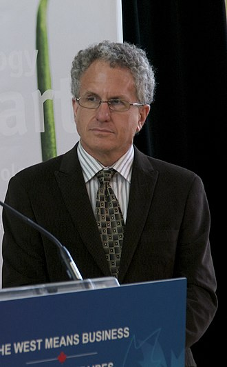

### Introduction

Le terme "jeu combinatoire à information parfaite" définit une catégorie de jeux respectant 4 critères:

- 2 joueurs (ou 2 équipes) s'opposent;
- Ils jouent à tour de rôle;
- Toutes les données sont connues par les 2 joueurs (information parfaite);
- Il n'y a aucun hasard.

Dans cette catégorie de jeux, les plus connus sont les échecs, les dames et le jeu de Go. C'est sur ces 3 jeux que mon étude porte, la popularité et la complexité de ces jeux les rendant intéressants pour développer des programmes informatiques permettant d'y jouer.

Notons qu'il existe de nombreux autres jeux correspondant à ces critères: Othello, Abalone, Hex, Puissance 4, Shôgi, Awélé...

  

### Le jeu de Dames

#### Histoire

Pour aborder l'histoire de la résolution du jeu de dames par l'informatique, un article de "The Atlantic"[^checkers-solved-atlantic] offre un récit détaillé de cette aventure, lui prêtant un air romanesque.
3 personnes sont mises en avant: Arthur Samuel, pionnier du Machine Learning dans les années 50, dont le programme bat un humain en 1963, mais dont les progrès restent très limités par les technologies de l'époque; Marion Tinsley, Champion du monde de Dames et considéré unanimement comme le plus grand joueur de tous les temps, ayant perdu seulement 3 fois entre 1950 et 1991; et Jonathan Schaeffer, programmeur qui développa le projet Chinook en 1989, qui dès 1992 affronta avec son programme Marion Tinsley et perdit de peu.

L'histoire racontée par The Atlantic est pourtant bien ancrée dans la réalité: c'est exactement la même histoire qui est raconté en 2008 par Jonathan Schaeffer lui-même dans son article publié dans Science annoncant que les dames étaient un jeu résolu (Checkers Was Solved)[^checkers-solved-paper]. En 3 paragraphes brefs, il décrit la même histoire et explique que, Tinsley étant malheureusement décédé en 1994, la revanche entre CHINOOK et lui avait été interrompue, la seule manière de prouver de manière convaincante la supériorité de l'ordinateur sur l'humain était de prouver rigoureusement que le jeu de Dames est un jeu résolu.

#### Présent: comment les dames furent résolues

Revenons à l'article publié par Jonathan Schaeffer[^checkers-solved-paper]

Qu'est-ce qu'un jeu résolu ? Schaeffer nous donne une défintion dans l'article, que nous retranscrirons donc ici: il donne en fait 3 définitions correspondant à 3 niveaux de résolution. Pour un jeu résolu ultra-faiblement, on connaît le résultat final d'un jeu joué à la perfection: ainsi, on sait que le jeu de Hex la victoire appartient au premier joueur, mais sur des grandes tailles de terrain on ne connaît pas la stratégie. Pour un jeu résolu faiblement, on connaît le résultat final et on dispose du moyen d'y arriver (c'est le cas des dames avec l'aide du programme CHINOOK). Enfin pour un jeu résolu fortement, toutes les positions de jeu possibles ont été calculés par l'ordinateur.

Ce n'est pas le cas des dames: avec ses 5x10^20 positions possibles, l'espace de recherche est considéré comme modéré par rapport à d'autres jeux, mais il reste inenvisageable de toutes les calculer.

Calculer toutes les positions est un méthode utile pour la fin de partie, lorsque le nombre de pièces restants en jeu est plus faible.

The complete 10-piece databases contain 39 trillion
positions (Table 1). They are compressed into 237
gigabytes

La base de données complètes pour 10 pièces ou moins comprend 39 mille milliards de positions (4.10^13), compressé en 237 Go (notons que la méthode de compression n'est pas la plus efficace possible en espace, car elle est conçue pour conserver un accès rapide aux données). Notons également que les données, pour chaque position, ne comprend que l'information minimale sr l'évalution (victoire/nulle/défaite) et non l'information sur le meilleur coup à jouer.

En 1989, seulement pour 4 pièces. Monté à 8 pièces en 1996, puis entre 2001 et 2005 la base pour 10 pièces fut calculée.

#### Futur

Jeu résolu

### Les échecs

#### Historique

De la pointe de la recherche en IA à un sujet dont le tour a été fait ?

The Tinsely challenge
. . .The American Checker Federa- tion’s challenge match for a purse of $5,000 or more

A letter received from Dick Fort-man states: “I note in Dr. Samuel’s IBM article that he calculates the possible moves in checkers as 10^40 . [It is] a figure of such great magnitude that it overwhelms everything else in the universe except figures of greater value

Citation de Samuel 1559 reprise en 1979:
an analysis must be made proceeding backward from the evaluated board positions through the ‘tree’ of possible moves, each time with consideration of the intent of the side whose move is being examined, assuming that the opponent would always attempt to minimize the machine’s score while the machine acts to maximize its score. At each branch point, then, the corres- ponding board position is given the score of the board position which would result from the most favorable move. Carrying this ‘minimax’ proce- dure back to the starting point results in the selection of a ‘best move. '

Dans le même journal, le Personnal Computers sont décrits comme "burgeoning new technology"

Le lien entre échecs et dames: Un article par Jonathan Schaeffer.
Rédigé après la défaite du programme Deep Thought contre World Champion Garry Kasparov, et après  la défaite Tinsley narrowly defeated Chinook 8.5 - 7.5 en décembre 1990, Schaffer compare les deux? prédisant la défaite de Kasparov d'ici la fin de la décennie

The move with the highest minimax score may not be the best move to maximize
winning chances. Consider a position with the choice of two moves, m1 and m2:
m1: leads to a persistent advantage but the opponent will have no difficulty finding the right sequence of moves to draw.
m2: leads to a dead draw. However, there are a couple of traps along the way that require the opponent to resist playing the "obvious" move

Our estimate is that an exact representation (win, loss or draw) of the 8-piece databases might be compressible to 15-20 gigabytes.

As the chess/checkers program becomes stronger, it becomes harder to find quality opponents to exercise the program’s skill. Testing the program in the laboratory is insufficient to cover all the cases that arise in man-machine play. Hence we must go out and seek matches against the world’s top players. This is not easy to do without appropriate financial incentives for the human players. It’s difficult to get enough games played against top-quality opposition.

Checkers Is Solved
Jonathan Schaeffer

Artificial intelligence technology has been used to
generate strong heuristic-based game-playing
programs, such as DEEP BLUE for chess. Solving a game
takes this to the next level, by replacing the heuristics
with perfection

Since Claude Shannon’s seminal paper on the structure of a
chess-playing program in 1950 (1), artificial intelligence
researchers have developed programs capable of
challenging and defeating the strongest human players in
the world. Super-human-strength programs exist for
popular games such as chess [DEEP FRITZ (2)], checkers
[CHINOOK (3)], Othello [LOGISTELLO (4)] and Scrabble
[MAVEN (5)]

#### Les engins modernes

- Compétitions entre engins
- Stockfish vs NN-based (+NN Sotckfish)
- Open Source: l'exemple de Stockfish vs ChessBase

#### Evolutions

#### La perspective joueur

##### Le joueur lambda: un accès permanent à un adversaire et partenaire d'entraînement

##### Le joueur professionnel: un outil d'entraînement puissant

Interview de Vishy Anand en 2008, alors Champion du Monde[^anand-quote].

> Anand: The computer is an excellent training partner. It helps me to improve my game.
> SPIEGEL: But if chess becomes a computer game and every move is calculated by the machine, then isn't the human being simply moving the pieces, and won't every game end in a draw?
> Anand: No. Actually I was always pessimistic. Ten years ago I said that 2010 would be the end, chess would be exhausted. But it is not true, chess will not die so quickly. There are still many rooms in the building which we have not yet entered. Will it happen in 2015? I don't think so. For every door the computers have closed they have opened a new one.

Traduction:
> Anand: L'ordinateur est un excellent partenaire d'entraînement. Il m'aide à améliorer mon jeu.
> SPIEGEL : Mais si les échecs deviennent un jeu informatique et que chaque mouvement est calculé par la machine, alors l'être humain ne se contente-t-il pas de bouger les pièces, et chaque partie ne se terminera-t-elle pas par un match nul ?
> Anand : Non. En fait, j'ai toujours été pessimiste. Il y a dix ans, je disais que 2010 serait la fin, les échecs seraient épuisés. Mais ce n'est pas vrai, les échecs ne mourront pas si vite. Il reste encore de nombreuses pièces dans le bâtiment dans lesquelles nous ne sommes pas encore entrés. Cela arrivera-t-il en 2015 ? Je ne pense pas. Pour chaque porte que les ordinateurs ont fermée, ils en ont ouvert une nouvelle.

2 mois plus tard, Levon Aronian [^aronian-quote]:
> Chess programs are our enemies, they destroy the romance of chess. They take away the beauty of the game. Everything can be calculated.
Cependant dans le même interview il affirme "Women cannot play chess."

###### Stockfish ELO

Finally, rating Stockfish on a human scale (e.g. FIDE Elo) has become an almost impossible task,
Evaluer Stockfish contre des humains est devenu presque impossible, dû à la différence de niveau. Si l'humain perd 100 matches contre l'IA, on ne peut pas calculer d'ELO, il faut qu'il y ait au moins des matchs nuls pour évaluer.

### Le jeu de Go

Alpha Zero

### KK

[^checkers-solved-atlantic]:
    Madrigal, Alexis C. « How Checkers Was Solved ». The Atlantic, 19 juillet 2017. <https://www.theatlantic.com/technology/archive/2017/07/marion-tinsley-checkers/534111/>.

[^checkers-solved-paper]:
    Schaeffer, Jonathan, Yngvi Björnsson, Akihiro Kishimoto, Martin Müller, Robert Lake, Paul Lu, et Steve Sutphen. « Checkers Is Solved ». Science 317 (1 octobre 2007): 1518‑22. <https://doi.org/10.1126/science.1144079>.

[^anand-quote]:
    Chess News. « Vishy Anand: “Chess Is like Acting” », 1 octobre 2008. <https://en.chessbase.com/post/vishy-anand-che-is-like-acting->.

[^aronian-quote]:
    Chess News. « Aronian: “I Have a Lot of Blood in My Brain” », 20 novembre 2008. <https://en.chessbase.com/post/aronian-i-have-a-lot-of-blood-in-my-brain->.
